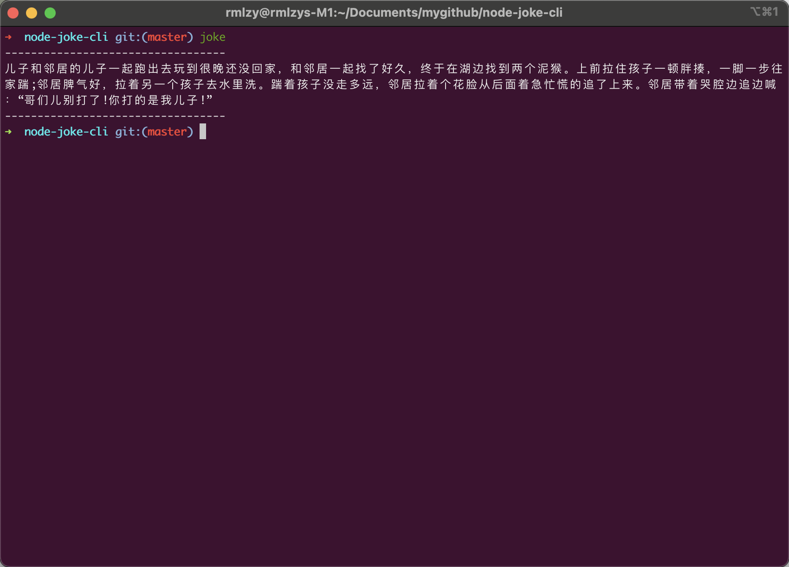

Type `joke` in your terminal, your will get it.

## Installation

```bash
$ npm i -g node-joke-cli

# or
$ yarn global add node-joke-cli
```

## Preview



## Usage
```bash
$ joke
```


## License
MIT
